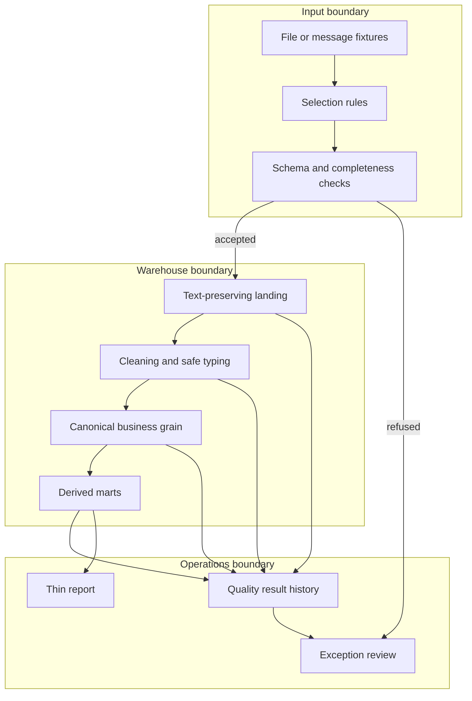

# Architecture

## Scope

This document describes a public-safe reference design. Names and examples are fictional. It deliberately avoids production topology, identifiers, schedules, data volumes, and organization-specific rules.

The executable repository uses Python standard-library code and a local SQLite database so every control can be reviewed without a cloud account or credential. SQLite represents the warehouse boundary for the demo; it is not presented as equivalent to BigQuery in scale or operation.

## System flow

## Layer contracts

| Layer | Contract | Mutability | Failure behavior |
|---|---|---|---|
| Selection | identify the intended input without relying on a display label alone | read-only | ambiguity is refused and explained |
| Validation | required structure and record-level constraints pass before a write | read-only | no partial downstream write |
| Landing | preserve source-shaped fields as text plus provenance metadata | append | malformed values remain visible |
| Cleaning | normalize whitespace, identifiers, dates, and numerics with safe conversions | redeployable view | invalid conversions become explicit null/error states |
| Canonical table | one documented business grain and key | bounded rewrite | duplicates and orphan keys fail checks |
| Mart | reusable business rules over canonical data | date-bounded and idempotent | incomplete windows are rejected |
| Presentation | bounded extract or view; no independent source-of-truth logic | replaceable | source-to-report totals must reconcile |
| Quality history | append named outcomes and evidence | append | query errors are `ERROR`, never `PASS` |

## Reference modules

The reference modules are implemented in `commerce_data_automation/`. Generated landing, exception, mart, report, quality, summary, and SQLite artifacts are written to an ignored output directory selected by the reviewer.

### Ingestion controls

- Select by content and provenance, not only by filename or subject.
- Discover headers instead of assuming a fixed row.
- Treat stale, empty, partial, or ambiguous input as refusal states.
- Preserve the received payload outside the public repository; the demo uses generated fixtures only.

### Warehouse model

- Landing values stay text-preserving so one malformed field does not erase the rest of the input.
- Safe typing and normalization happen in reviewable transformations.
- Canonical tables declare their grain and keys.
- Refreshes are scoped to a bounded business date and designed to be repeatable.

### Reporting model

- Business rules are computed in reusable warehouse logic.
- The report reads a bounded dataset and does not host competing raw dumps.
- Acceptance includes row, unit, value, and key reconciliation appropriate to the synthetic demo.

## Trust and approval boundaries

Reads and calculations can proceed automatically inside an authorized sandbox. Changes to production data, schedules, credentials, or visibility require a separately reviewed plan and explicit human approval. This reference does not include a live connector or production write path.

## Named failure cases

| Failure | Expected response |
|---|---|
| stale or partial input | refuse the load and record why |
| schema drift | identify missing, extra, and positionally changed fields |
| duplicate business grain | fail the affected output; do not silently collapse unless a documented rule exists |
| orphan reference key | preserve and report the exception |
| query/check execution error | record `ERROR`; never convert absence into `PASS` |
| repeated bounded run | produce the same result without duplicating history |
| report mismatch | stop acceptance and retain both comparison sides |

## Deliberate non-claims

No particular cloud configuration, schedule, data volume, test result, performance result, or production availability is represented by this document.
