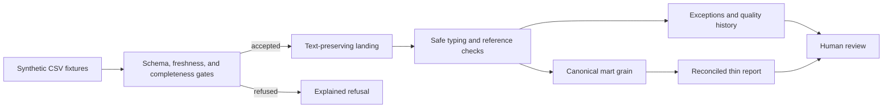

# Commerce Data Automation Platform

A credential-free clean-room reference for turning inconsistent operational CSV files into text-preserving landing data, explicit quality results, governed marts, and reconciled reporting.

The executable demo is intentionally local: Python's standard library performs validation and transformation, and SQLite represents the warehouse boundary. It uses only invented fixtures and makes no network or cloud request. The layer contracts can be adapted to BigQuery, but this repository does not include a live BigQuery connector or production configuration.

## Why this exists

Operational files can open successfully while still being unsafe for downstream use. A shifted header, stale export, partial attachment, malformed value, duplicate business grain, orphan key, or failed check can all produce believable output if the pipeline fails open.

This reference makes refusal and exception behavior visible. It demonstrates:

- exact positional schema contracts;
- freshness and completeness gates before downstream writes;
- an all-text landing layer that retains rejected rows;
- safe date and numeric conversion;
- duplicate-grain and orphan-key quarantine;
- quality verdicts that keep `PASS`, `WARN`, `FAIL`, and `ERROR` distinct;
- idempotent period replacement in a local SQLite warehouse;
- source-to-mart and mart-to-report reconciliation;
- a thin report with no independent source-of-truth logic.

## Architecture



See [ARCHITECTURE.md](ARCHITECTURE.md) for the layer contracts and [assets/architecture.mmd](assets/architecture.mmd) for the standalone Mermaid source.

## Quick start

Requirements: Python 3.11 or newer. There are no third-party runtime or test dependencies.

```text
python -m unittest discover -s tests -v
python -m commerce_data_automation demo --output-dir build/demo
```

The demo runs the same bounded period twice, checks that deterministic exports do not change, and compares the generated mart and report with the expected synthetic fixtures.

The verified fixture produces:

- 4 input records retained in landing;
- 2 accepted records;
- 3 explicit exception entries across 2 rejected records;
- 2 mart rows and 2 report rows;
- all four quality states, including a deliberately simulated `ERROR`;
- reconciled totals of 5 units and 3,000 invented minor `TST` units.

These are synthetic demo results, not historical production metrics. The exact validation record is in [docs/VALIDATION_RESULTS.md](docs/VALIDATION_RESULTS.md).

## Commands

Create a new deterministic fixture set without reading any external input:

```text
python -m commerce_data_automation generate --output-dir build/generated --seed 20300102
```

Run the pipeline over the repository fixtures:

```text
python -m commerce_data_automation run --input examples/source_feed.csv --reference examples/product_reference.csv --output-dir build/run --as-of 2030-01-05 --simulate-check-error SOURCE_B
```

Independently compare the generated mart and report with expected CSVs:

```text
python -m commerce_data_automation verify --output-dir build/run --expected-mart examples/mart_sample.csv --expected-report examples/report_sample.csv
```

Generated artifacts are written under the selected output directory and excluded from Git. They include landing, exception, mart, report, quality-result, summary, and SQLite files.

## Repository map

- `commerce_data_automation/` — deterministic generator, pipeline, quality controls, SQLite persistence, and CLI.
- `tests/` — twelve mapped validation scenarios plus a duplicate-input-key refusal test.
- `examples/` — invented input, reference, expected mart, report, and illustrative quality fixtures.
- `docs/` — runbook, synthetic-data rules, validation specifications/results, and dependency review.
- top-level design documents — architecture, case study, AI-assisted method, security, data dictionary, and publication controls.

## Historical and contribution boundary

The historical work that informed this generic reference involved translating operating requirements into data grains, validation rules, exception paths, and approval gates; shaping and operating an architecture; directing and contributing to AI-assisted implementation; investigating failures; and validating outputs against source records.

This repository is newly written. It contains no employer/client source code, SQL, notebook, configuration, data, identifier, URL, credential, production rule, screenshot, Git history, or quantitative outcome. It does not reproduce or claim to be the original system.

## AI-assisted development

AI coding assistance accelerated design, implementation, debugging, tests, review, and documentation. Human judgment defined the requirements, synthetic boundaries, failure semantics, and acceptance criteria. Deterministic tests and independent reconciliation—not AI judgment—validate the runtime behavior. See [AI_ASSISTED_DEVELOPMENT.md](AI_ASSISTED_DEVELOPMENT.md).

## Security and limitations

- No credential, environment file, network client, cloud SDK, or production input path exists.
- Fixtures are invented rather than masked or transformed from real records.
- SQLite is a portable demonstration boundary, not a performance or cloud-equivalence claim.
- The simulated check error exists only to prove that exceptions become `ERROR`, never `PASS`.
- No production availability, scale, performance, savings, accuracy, or reliability claim is made.

See [SECURITY_AND_PRIVACY.md](SECURITY_AND_PRIVACY.md) and [docs/DEPENDENCY_REVIEW.md](docs/DEPENDENCY_REVIEW.md).

## Reuse status

No license file is included. The repository is public for viewing but is not described as open source and does not grant reuse rights. See [REUSE_STATUS.md](REUSE_STATUS.md).
